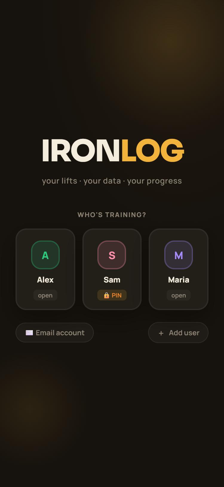

# 💪 IronLog

**A self-hosted workout tracker for you and your training partners.** Build programs, log live sessions with supersets and drop sets, follow your progress on charts, and see which muscles have recovered. It runs on your own small Node.js server and installs on phones as an app (PWA).


<p align="center"></p>

## Features

- 👥 **Multiple users** on one server, each with an optional **PIN**, plus optional e-mail accounts.
- 📋 **Programs & workouts**: build your own or copy from the public library (e.g. *Push/Pull/Legs*, *Bro Split*), with **supersets**.
- ⏱️ **Live sessions**: log sets as you go, with **drop sets**, skip-set, a wall-clock **rest timer**, and server-side **resume** if your phone dies mid-workout.
- 📈 **Stats**: volume per week, sets, days trained, time, and per-exercise progress charts.
- ⚖️ **Body-weight log** with a trend chart.
- 🧍 **Body Lab**: an interactive 3D anatomy view coloured by what you've trained and how recovered each muscle is, plus quick readiness check-ins *(needs a 3D model, see below)*.
- 🏋️ **Gyms**: remember where you train.
- 💬 **Social**: follow your training partners, get notified when they train, and message each other.
- 💾 **Export** your data as JSON. An **admin panel** manages users and programs.
- 📴 **Works offline**: a service worker caches the app and an offline queue syncs your sets when you're back online.

---

## Installation

Requires **Node.js 18+**.

```bash
git clone https://github.com/deniskostadinov1995/ironlog.git
cd ironlog
npm install
npm start
```

Open **http://localhost:3001**. On first start the server creates `db.json` with three demo users (Alex, Sam with PIN `1234`, Maria) and two example programs. Delete or rename them in the admin panel.

To use it from your phone, open `http://<your-pc-ip>:3001` on the same Wi-Fi and choose **Add to Home Screen**. To reach it from outside your home, put it behind HTTPS (e.g. a Cloudflare Tunnel or a reverse proxy).

### Configuration (environment variables)

| Variable | Default | Meaning |
|---|---|---|
| `PORT` | `3001` | HTTP port |
| `IRONLOG_ADMIN_PASS` | *(unset)* | Password for the **admin panel**. While it's unset the admin panel is disabled. |

```bash
# Windows PowerShell
$env:IRONLOG_ADMIN_PASS = "a-long-random-password"; npm start
# macOS / Linux
IRONLOG_ADMIN_PASS="a-long-random-password" npm start
```

### The 3D body model

The Body Lab expects a rigged human mesh at `public/MascularMale.glb` (with muscle regions mapped in `public/zones.json`). The model isn't included in this repository for licensing reasons. Without it, the app works normally and the 3D panel shows *"3D unavailable"*. You can also point `window.__BODY_GLB_URL` at your own model.

---

## How it works

- **Backend:** `server.js` is a single Express app with a JSON file database (`db.json`). Writes are atomic (temp file + rename) and batched. The server keeps a daily backup rotation in `db-backups/` (7 days) and rate-limits auth and admin attempts.
- **Frontend:** plain ES modules in `public/` (`App.js`, `design.js`, `body3d.js`). React 19 and Recharts load from [esm.sh](https://esm.sh) through an import map, and Three.js loads on demand for the 3D view. **There is no build step.**
- **Data safety:** every user's history, weights, gyms and sessions live in `db.json`. Back it up, and never commit it (it's git-ignored).

| Path | Purpose |
|---|---|
| `server.js` | REST API (`/api/...`), auth, admin, static file server |
| `public/App.js` | The app UI |
| `public/design.js` | Design-system components (layout, sidebar, bottom nav…) |
| `public/body3d.js` + `zones.json` | 3D anatomy viewer |
| `public/sw.js`, `manifest.webmanifest` | Offline support and installability |
| `public/api-config.js` | Set `window.__IRONLOG_API__` when wrapping the app in a native shell (e.g. Capacitor) |

## License

[MIT](LICENSE) © Denis Kostadinov
